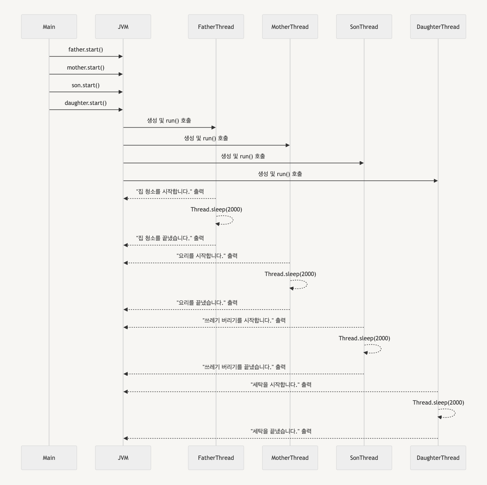

#### 날짜: 2024-05-25

<br/>

### 🌤️ 스크럼

- 학습 목표 1 : Thread 이해하기

<br/>

### ⚡️ 새로 배운 내용

#### [JAVA] Thread

코드의 여러 부분이 동시에 실행되는 구조를 만들기 위한 각각의 처리 흐름

> 코드에서 처리 흐름(스레드)을 늘리는 행위를 "**스레드를 기동한다**" 라고 한다.

- **스레드가 필요한 이유**

  멀티태스킹(여러 작업(프로세스)을 동시에 처리)을 구현하기 위해  
  → 반복문으로 동작하는, 매우 오랜 시간이 걸리는 작업이 수행되는 도중에 다른 스레드에 의해 다른 작업을 수행할 수 있다.

  - IO 작업이 많은 경우  
    파일 읽기/쓰기, 네트워크 통신 등의 대기 시간이 길어질 수 있는 작업을 비동기적으로 처리하기 위해
  - UI 응답성 향상  
    GUI 프로그램에서 사용자의 입력을 받는 동안에도 다른 작업을 수행할 수 있도록 하기 위해
  - 병렬 처리  
    여러 작업을 동시에 수행하여 성능을 향상시키기 위해

- **스레드 기동하기**

  - `Thread` 클래스를 상속받아 확장하여 사용

    ```java
    class MyThread extends Thread {
      public void run() {
        // 스레드가 실행할 코드
      }
    }

    public class Main {
      public static void main(String[] args) {
        MyThread t = new MyThread();
        t.start(); // 스레드 기동
      }
    }
    ```

  - `Runnable` 인터페이스를 구현하여 사용

    - 자바에서는 다중 상속을 지원하지 않기 때문에, 이미 다른 클래스를 상속받은 경우 `Runnable` 인터페이스를 구현하여 사용한다.
    - 스레드와 비즈니스 로직을 분리하여 코드의 가독성과 유지보수성을 향상시킬 수 있다.

    ```java
    class MyThread implements Runnable {
      @Override
      public void run() {
        // 스레드가 실행할 코드
      }
    }

    public class Main {
      public static void main(String[] args) {
        MyThread t = new MyThread();
        Thread thread = new Thread(t);
        thread.start(); // 스레드 기동
      }
    }
    ```

  - Thread 클래스를 확장한 클래스는 반드시 그 안에 run() 메소드를 오버라이딩해야 한다.
  - `start()` 메소드를 호출하면 새로운 스레드가 생성되고, `run()` 메소드가 실행된다.

  <details>
  <summary>스레드의 실행 과정 예시</summary>

  ```java
  public class MainThreadHome {
      public static void main(String[] args) {
          // 가족 구성원이 해야하는 작업을 생성
          Task cleaning = new Task("집 청소");
          Task cooking = new Task("요리");
          Task takingOutTrash = new Task("쓰레기 버리기");
          Task laundry = new Task("세탁");

          // 각 작업을 수행할 사람(스레드)을 생성
          Thread father = new Thread(cleaning);
          Thread mother = new Thread(cooking);
          Thread son = new Thread(takingOutTrash);
          Thread daughter = new Thread(laundry);

          // 각 구성원의 작업을 시작
          // 스레드 객체에서 start() 함수를 실행하면 JVM에 의해서 스레드가 만들어지게 된다.
          // 그 후 JVM 은 생성한 스레드 내부에 `@Override` 된 run() 메서드를 호출한다.
          father.start();
          mother.start();
          son.start();
          daughter.start();
      }
  }
  ```

  ```java
  // 작업을 나타내는 클래스 (Runnable은 Thread에 배정된다.)
  class Task implements Runnable {
      private String taskName;

      // 생성자
      public Task(String taskName) {
          this.taskName = taskName;
      }

      // run 메서드를 오버라이드하여 작업을 정의
      // 콜러측에서 start() 함수 실행 시 JVM에서 스레드를 할당하고 해당 객체의 run() 메서드를 실행 시키게 된다.
      @Override
      public void run() {
          System.out.println(taskName + "를 시작합니다.");
          try {
              // 작업을 수행하는 데 걸리는 시간(예: 2초)
              Thread.sleep(2000);
          } catch (InterruptedException e) {
              System.out.println(taskName + " 작업 중단됨");
          }
          System.out.println(taskName + "를 끝냈습니다.");
      }
  }
  ```

  

  </details>
  <br/>

- **스레드의 메모리 공유**

  - 스레드는 프로세스 내의 메모리를 공유한다.
  - 여러 스레드가 동일한 객체를 공유하면서 그 객체의 상태를 변경할 수 있다.

  ```java
  // 공유 데이터를 가진 클래스
  class SharedCounter {
    public int count = 0; // 공유 데이터

    public synchronized void increment() {
      count++;
      System.out.println(Thread.currentThread().getName() + ": " + count);
    }

    public int getCount() {
      return count;
    }
  }

  // 스레드 클래스
  class MyThread extends Thread {
    private SharedCounter sharedCounter; // 공유 데이터를 가진 객체

    public MyThread(sharedCounter sharedCounter) { // 생성자에서 공유 데이터를 받음
      this.sharedCounter = sharedCounter;
    }

    @Override
    public void run() {
      for (int i = 0; i < 50; i++) {
        sharedCounter.increment();

        try {
          Thread.sleep(100);
        } catch (InterruptedException e) {
          e.printStackTrace();
        }
      }
    }
  }

  public class Main {
    public static void main(String[] args) {
      SharedCounter sharedCounter = new SharedCounter(); // 공유 데이터 객체 생성

      MyThread t1 = new MyThread(sharedCounter); // 공유 데이터 객체를 스레드에 전달
      MyThread t2 = new MyThread(sharedCounter);

      t1.start(); // 스레드 시작
      t2.start();

      try {
        t1.join(); // 스레드가 종료될 때까지 기다림
        t2.join();
      } catch (InterruptedException e) {
        e.printStackTrace();
      }

      System.out.println("최종 카운트: " + sharedCounter.getCount());
    }
  }
  ```

  ```
  // 출력 결과
  Thread-0: 1
  Thread-1: 2
  Thread-0: 3
  Thread-1: 4
  ...
  최종 카운트: 100
  ```

  - 위 코드에서 `SharedCounter` 클래스는 공유 데이터를 가지고 있으며, `increment()` 메소드를 통해 공유 데이터를 증가시킨다.
  - 만약 스레드들이 메모리 공간을 공유하지 않고, 각각의 메모리 공간을 가지고 있다면, 최종 카운트는 언제나 50이 될 것이다.
  - 하지만 100 이하의 숫자가 출력되는 경우가 발생한다.
    - 이를 해결하기 위해 synchronized 키워드를 사용하여 메소드에 동기화를 걸어준다.
    - [`레이스 컨디션(Race Condition)`](https://github.com/yoouung/TIL-KCS/blob/main/May/2024-05-26.md)

- **스레드의 조작**

  - `join()` 메소드

    - 다른 스레드가 종료될 때까지 기다리는 메소드
    - `join()` 메소드를 호출한 스레드는 대기 상태가 되며, 다른 스레드가 종료되면 실행을 재개한다.

    ```java
    public class Main {
      public static void main(String[] args) {
        MyThread t = new MyThread();
        t.start();

        try {
          t.join(); // t 스레드가 종료될 때까지 기다림
        } catch (InterruptedException e) {
          e.printStackTrace();
        }

        System.out.println("메인 스레드 종료");
      }
    }
    ```

  - `sleep()` 메소드

    - 일정 시간 동안 스레드를 대기 상태로 만드는 메소드
    - 밀리초 단위로 시간을 지정할 수 있다.

    ```java
    Class MyThread extends Thread {
      public void run() {
        for (int i = 0; i < 10; i++) {
          System.out.println(i);

          try {
            Thread.sleep(1000); // 1초 대기
          } catch (InterruptedException e) {
            e.printStackTrace();
          }

        }
      }
    }
    ```

  - `interrupt()` 메소드

    - 스레드를 강제로 종료시키는 메소드
    - 스레드가 `sleep()` 메소드 등으로 대기 상태에 있을 때, `interrupt()` 메소드를 호출하면 `InterruptedException` 예외가 발생하여 스레드가 종료된다.

    ```java
    public class Main {
      public static void main(String[] args) {
        MyThread t = new MyThread();
        t.start();

        try {
          Thread.sleep(1000);
          t.interrupt(); // t 스레드 강제 종료
        } catch (InterruptedException e) {
          e.printStackTrace();
        }

        System.out.println("메인 스레드 종료");
      }
    }
    ```

<br/>

### ~~🔥 오늘의 도전 과제와 해결 방법~~

<br/>

### 🤔 오늘의 회고

- 스크럼 중 완료한 작업: `완료한 작업`
- 성공적인 점, 개선해야 할 점, 새롭게 시도하고 싶은 방법 등을 포함할 수 있습니다.

<br/>

### 참고 자료 및 링크

- [그림으로 배우는 자바 프로그래밍] 15. 스레드
